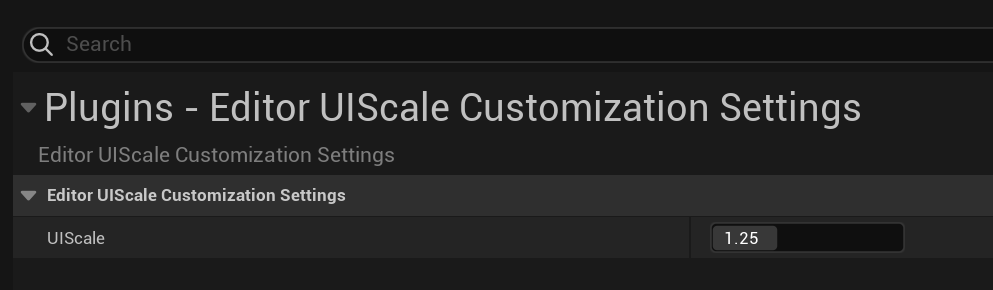

# UE-EditorUIScaleCustomization

This Plugin is UnrealEngine Editor change UserInterface Scale for High DPI Monitor.

## Setup

`{{ your-project }}/Plugins/`

Clone to the above path or extract the project downloaded as a Zip. Build it.

## How to Use

`EditorPreferences/Plugins/EditorUIScaleCustomizationSettings`

Change `UIScale` Property.

## Is this convenient for you?

Please ☕

